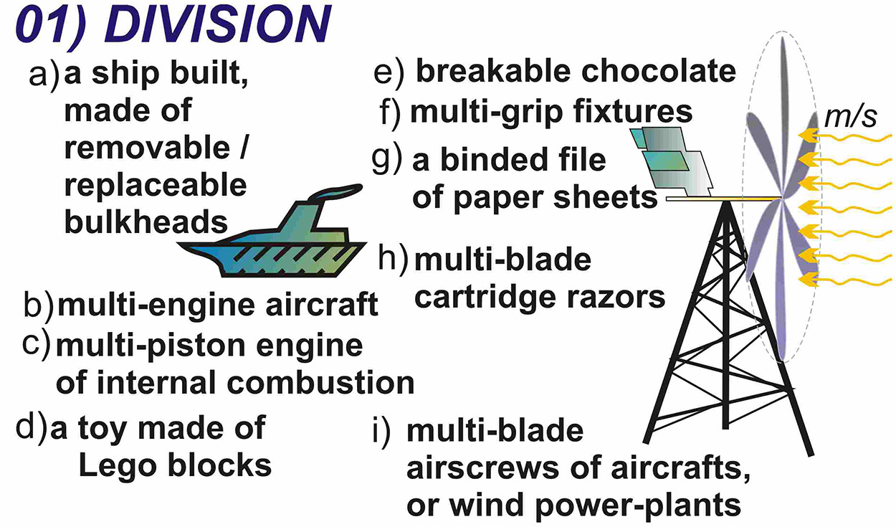
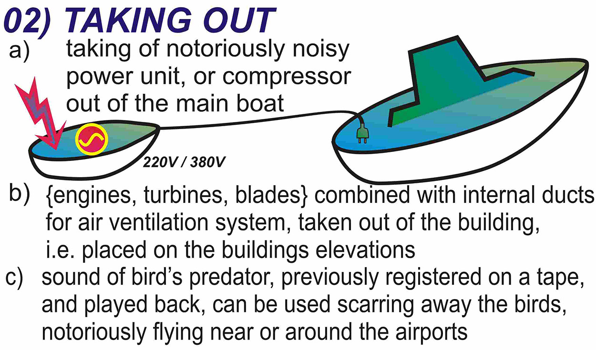

###1. Segmentation

**Divide an object into independent parts.**

Replace mainframe computer by personal computers.

Replace a large truck by a truck and trailer.

Use a work breakdown structure for a large project.

**Make an object easy to disassemble.**

Modular furniture

Quick disconnect joints in plumbing

**Increase the degree of fragmentation or segmentation.**

Replace solid shades with Venetian blinds.

Use powdered welding metal instead of foil or rod to get better penetration of the joint.

###2. Taking out

**Separate an interfering part or property from an object, or single out the only necessary part (or property) of an object.**

Locate a noisy compressor outside the building where compressed air is used.

Use fiber optics or a light pipe to separate the hot light source from the location where light is needed.

Use the sound of a barking dog, without the dog, as a burglar alarm.